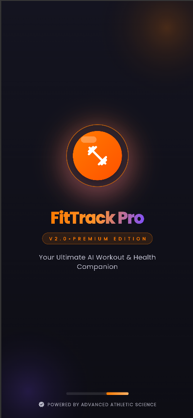
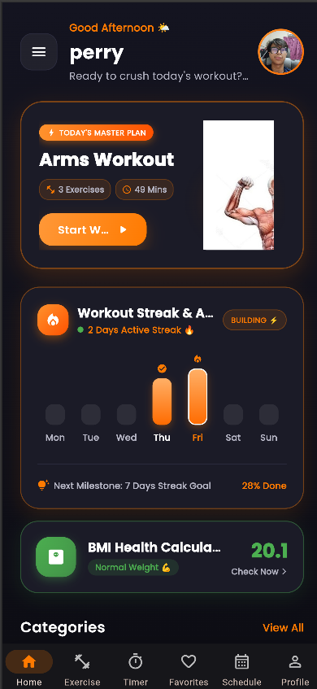
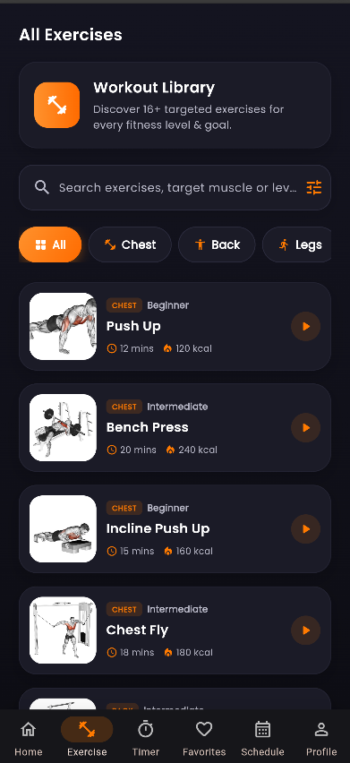
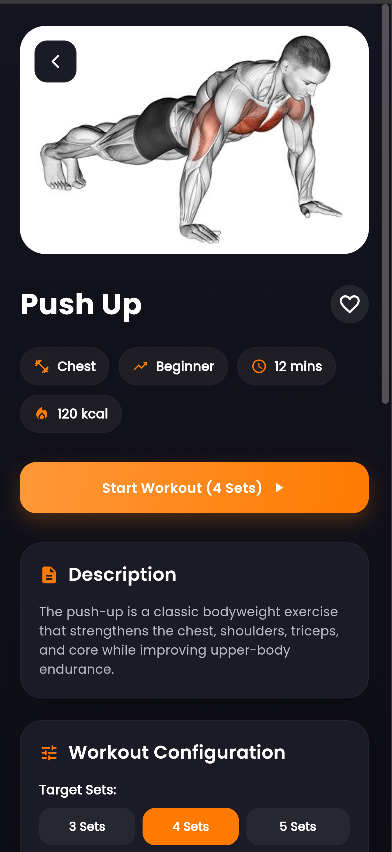
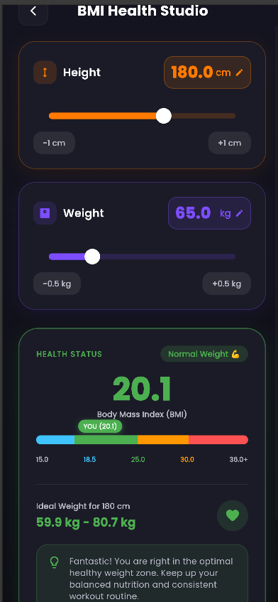
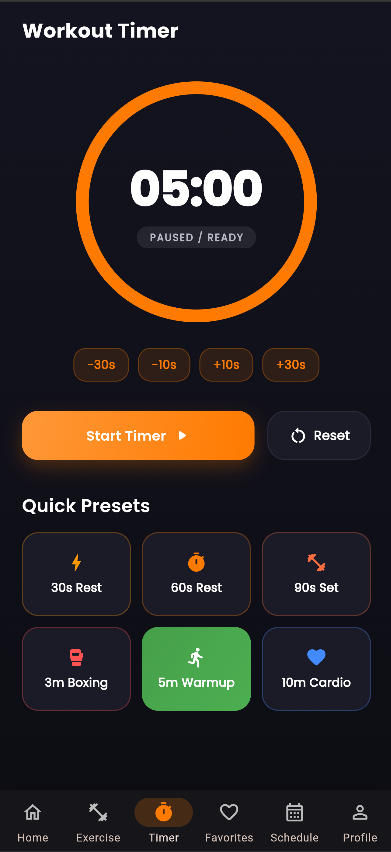
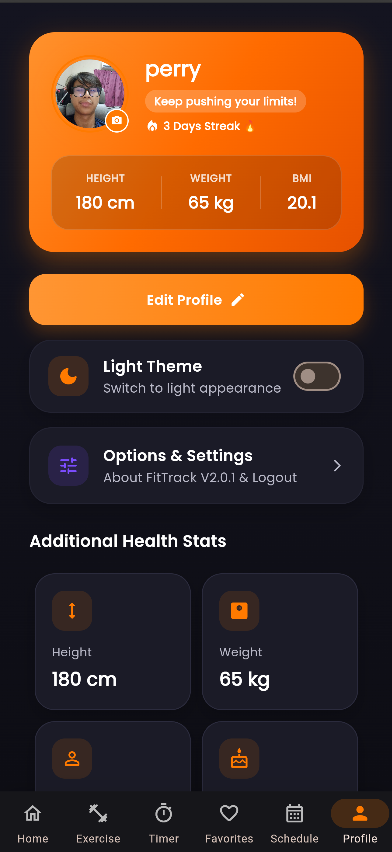
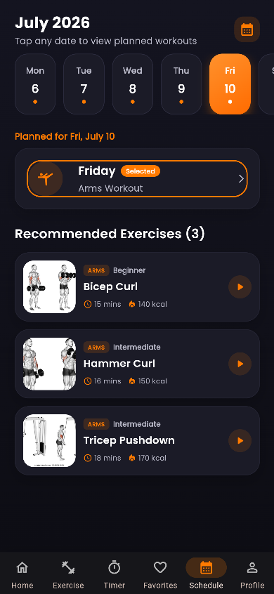

# FitTrack V2 – Workout Planner Mobile Application

FitTrack V2 is a mobile workout planner application developed using **Flutter** and **Dart** as an academic project.

The application provides users with workout planning features and fitness-related tools, including workout information, BMI calculation, exercise timing, favorites, scheduling and profile management.

## 📱 Screenshots

Here are some screenshots of FitTrack V2, showcasing the main features of the application.

### 🚀 Splash Screen & Home

| Splash Screen | Home Screen |
|:---:|:---:|
|  |  |

### 🏋️ Workout

| Exercise List | Exercise Detail |
|:---:|:---:|
|  |  |

### ⚖️ Fitness Tools

| BMI Calculator | Workout Timer |
|:---:|:---:|
|  |  |

### 👤 Personalization

| Profile | Workout Schedule |
|:---:|:---:|
|  |  |

## ✨ Features

### 🏋️ Workout Management

- Browse workout categories
- View detailed workout information
- Organize and manage workout activities

### ⚖️ BMI Calculator

- Calculate Body Mass Index (BMI)
- Display BMI results based on user input

### ⏱️ Exercise Timer

- Timer functionality for workout sessions
- Supports timed exercise activities

### ❤️ Favorites

- Save preferred workouts for easier access

### 📅 Workout Schedule

- Create and manage workout schedules
- Organize planned workout activities

### 👤 Profile

- User profile interface
- Display personal fitness information

### 🔥 Firebase Integration

- Firebase integration for application functionality and configuration

## 🛠️ Technologies

| Technology | Purpose |
|------------|---------|
| **Flutter** | Mobile application development |
| **Dart** | Application programming language |
| **Firebase** | Backend services and application integration |
| **Android Studio** | Development and testing |
| **VS Code** | Development and source code editing |

## 📂 Application Structure

```text
lib/
├── main.dart
├── pages/
├── widgets/
└── ...
```
## 🚀 Getting Started
Prerequisites

Before running the project, make sure you have:

 - Flutter SDK installed
 - Dart SDK
 - Android Studio or VS Code
 - Android emulator or physical Android device

### 1. Clone the Repository

```bash
git clone https://github.com/ferryyirwan/fittrack-v2.git
```

### 2. Navigate to the Project

```bash
cd fittrack-v2
```

### 3. Install Dependencies

```bash
flutter pub get
```

### 4. Run the Application

```bash
flutter run
```

## 🎯 Project Purpose

This project was developed as part of my Diploma in Computer Science studies at Kolej Profesional MARA Beranang (KPM).

The project provides practical experience in mobile application development using Flutter and Dart, including:

 - Mobile user interface development
 - Multi-screen application design
 - Navigation between application screens
 - User input handling
 - Fitness-related calculations
 - Workout planning functionality
 - Application integration with Firebase
## 📚 Project Highlights

Through the development of FitTrack V2, I gained hands-on experience in:

 - Flutter application development
 - Dart programming
 - UI/UX implementation
 - Application navigation
 - State and data handling
 - Firebase integration
 - Mobile application testing and debugging
## 👨‍💻 Developer

Ferry Irwan

Diploma in Computer Science
Kolej Profesional MARA Beranang (KPM)

🔗 Links
GitHub: @ferryyirwan
LinkedIn: Ferry Irwan
